# CS 488 Final Project — Sunset Cityscape

The goal of this project was to create a short raytraced animation of a cityscape at sunset. The highlight of the project is a dynamic (time-varying) simulation of the sky over the course of a sunset, modeling Rayleigh scattering and Mie scattering. The final, 15 second animation can be viewed [on YouTube](https://youtu.be/cKN7hP73rXg).

# Report

## General Implementation Details

The raytracer is implemented from scratch in C++, using some provided code for PNG output and Lua bindings.

The scene is composed of a hierarchy of nodes and described in Lua, allowing for procedural generation of more complex scene elements from primitives (such as the buildings in the final scene). I wrote a helper in Lua that interprets a Lua table as a scene node, including recursively parsing any child tables as child nodes, making it much more intuitive to compose a scene by hand in a hierarchical structure. The details of the syntax for describing a scene node are documented in the function `parseNode` in the file [common.lua](Assets/common.lua), but it makes use of the fact that Lua tables allow both positional entries (for child nodes) and key-value entries (for properties of the node, such as translation/rotation/scale, material, etc.).

## Features

### 1. Reflections

<div align="center">
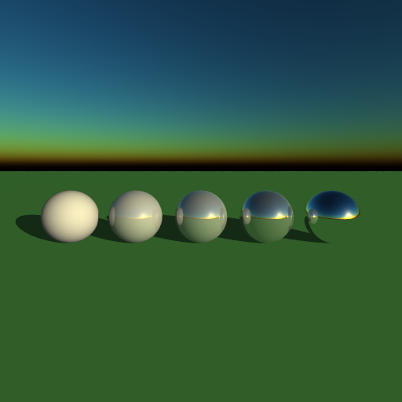

*Spheres with increasing reflectivity parameter from left (0.0) to right (1.0).*
</div>

Reflections are achieved using the standard technique. The **`reflectivity`** parameter of a material controls the percentage of light reflected at the surface (i.e. the percentage of the final colour determined by the reflected ray), while the remainder is determined by direct illumination (using the Phong lighting model). This is in order to remain somewhat energy-conserving, although not truly energy-conserving since the Phong lighting model itself is not energy-conserving.


### 2. Refractions

<div align="center">
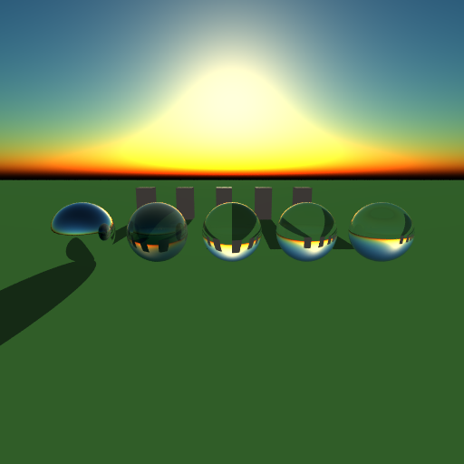

*The first sphere is a purely reflective sphere, for reference. The second sphere has 50% reflectivity and 50% transparency, with an refractive index of 1.33. The third, fourth and fifth spheres have 100% transparency, with increasing refractive index (1.33, 1.5, 1.7).*
</div>

Refractions are achieved using the standard technique. The angle of the refracted ray is computed based on the **`refractiveIndex`** material parameter using Snell's law (against a medium of air with a refractiveIndex of 1.0). When a ray is exiting the surface, the normal vector for the ray hit is flipped and the refractiveIndex is replaced with its reciprocal.

The **`transparency`** parameter of a material controls the percentage of light transmitted through the material (i.e. determined by the refracted ray), while the remainder is determined by the balance between reflected and direct illumination described above. However, I also modeled the Fresnel effect which causes surfaces to be more reflective at grazing angles, using Schlick's approximation to compute the Fresnel reflectance given a material's refractive index and the cosine of the angle of the ray hit. So the final contributions of direct, reflected and refracted illumination are given by:


```lua
    directContribution = (1.0 - reflectivity) * (1.0 - transparency)
    reflectedContribution = reflectivity * (1.0 - transparency)
                         + transparency * fresnelReflectance
    refractedContribution = transparency * (1.0 - fresnelReflectance)
```

This mixing model for direct, reflected and refracted illumination was adapted from [this article on "Graphics Compendium"](https://graphicscompendium.com/raytracing/11-fresnel-beer).

As an easy optimization, reflected and refracted rays are only cast for shading if their respective contribution is non-zero.


### 3. Glossy reflection/refraction

<div align="center">
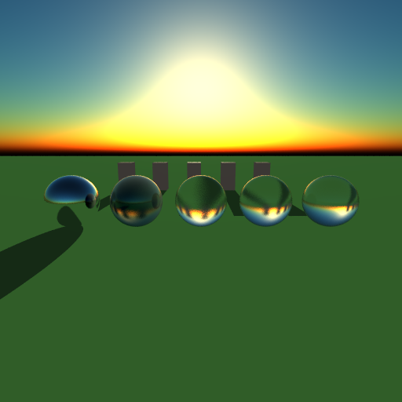

*Same as the previous scene, but each material has its glossiness parameter set to 0.05.*
</div>

For hits on a material with a non-zero **`glossiness`** parameter, multiple samples (4 by default) will be taken for reflection and refraction rays and averaged together. Each sample ray will be perturbed from its canonical direction by generating a random unit vector (i.e. a point on the unit sphere), scaling it down by the **`glossiness`**, and adding it to the canonical direction vector (and normalizing the sum). This results in more physically-accurate results than the technique described in class (of generating a point on a plane perpendicular to the canonical direction), as the perturbation follows a cosine distribution similar to that for light reflected from a Lambertian diffuse surface. I came up with this method on my own, but it was inspired by the method for forward-tracing bounces off Lambertian surfaces from ["Ray Tracing in One Weekend"](https://www.realtimerendering.com/raytracing/Ray%20Tracing%20in%20a%20Weekend.pdf).

Note that "glossiness" is actually an antonymous description for this parameter, as increasing the glossiness actually makes a surface appear more matte. A better name for this parameter might be "matteness" or "glossy perturbation".


### 4. Anti-aliasing

<div align="center">
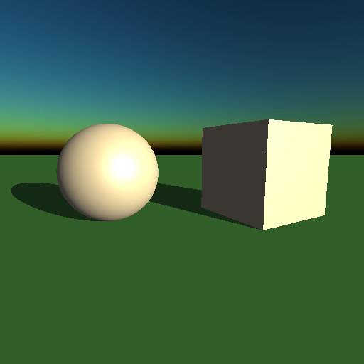


*The same scene rendered without (left) and with (right) anti-aliasing.<br />(Note that all other scenes shown were rendered with anti-aliasing on by default.)*
</div>

Anti-aliasing is achieved by super-sampling each pixel, by subdividing the area of each pixel into a 3x3 (by default) grid of subpixels and choosing a random point within each subpixel to determine the primary ray's direction, and averaging the colour for all 9 rays to determine the final colour.

Anti-aliasing is enabled or disabled at compile-time in Options.hpp in order to make use of preprocessor conditional code inclusion instead of runtime conditional branching, which may be slower.


### 5. Depth of field

<div align="center">
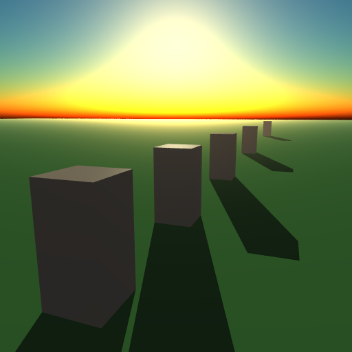


*The same scene rendered without (left) and with (right) anti-aliasing.<br />(Note that all other scenes shown were rendered with anti-aliasing on by default.)*
</div>

The **focalDistance** and **blurAmount** parameters for a scene define the depth of field. If blurAmount is non-zero, the image plane is scaled to the focalDistance, and multiple samples are taken for each primary ray, each with different origins. The origin is picked randomly on a square patch, with size determined by the blurAmount scaled by the focalDistance, centered the eye position, and perpendicular to the view direction. If anti-aliasing is off, the origins are sampled on a subdivided grid, just like how samples are taken for anti-aliasing (this is known as stratified super-sampling in general). If anti-aliasing is on, only one sample is taken for each anti-aliasing sample ray, so the origin is just determined randomly on the square patch.


### 6. Dynamic skydome (simulated atmosphere)

<div align="center">
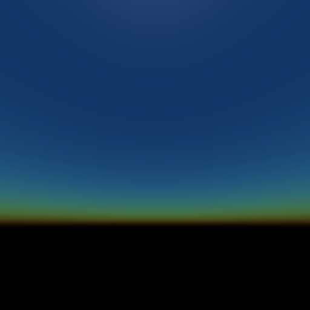
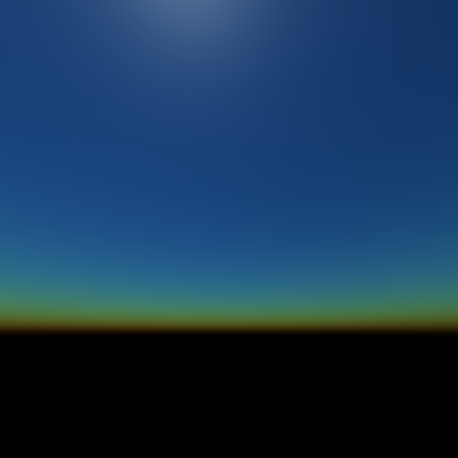
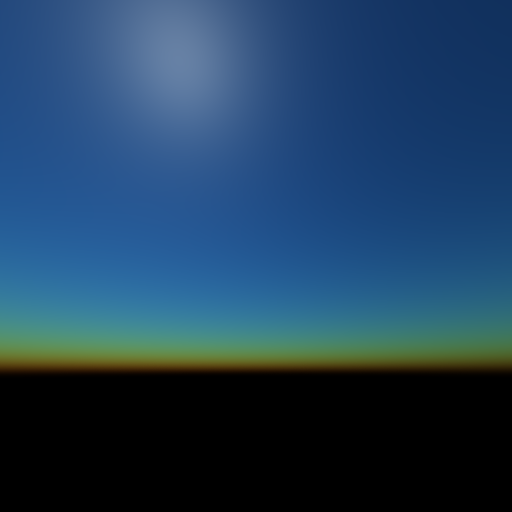
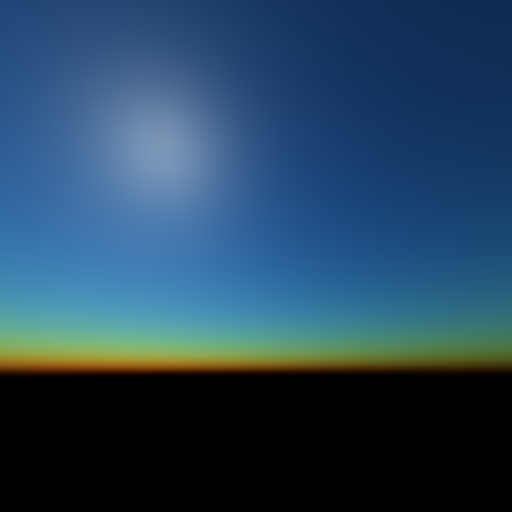
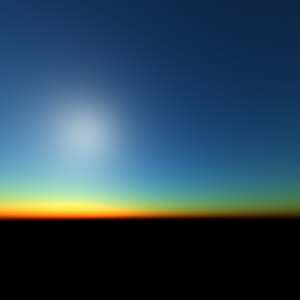
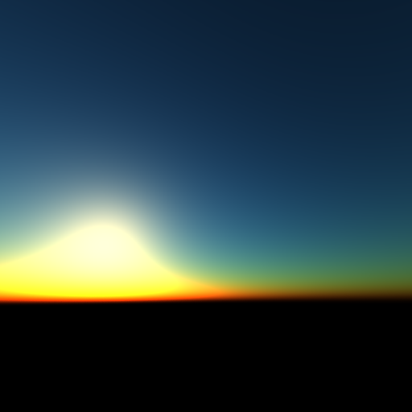
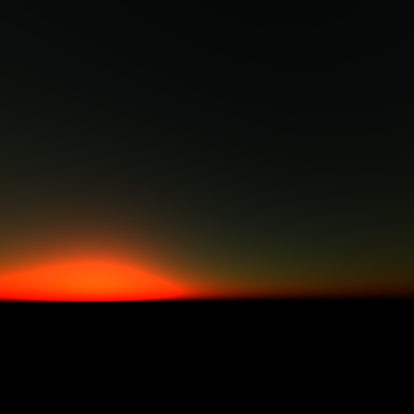

*The sky (an empty scene) from 12pm to 6pm in 1 hour increments.*

*Note: all other scenes shown are rendered with the sun position at 5pm (besides the final scene, which has the time of day varying from 4:30pm to just after 6pm).*
</div>

The color of the skydome in any given direction is computed following the techniques described in ["Display of the Earth Taking into account Atmospheric Scattering" (Nishita 1993)](http://nishitalab.org/user/nis/cdrom/sig93_nis.pdf). The blue colour of the sky is due to the fact that the atmosphere scatters shorter wavelengths of light (blue light) more readily than longer wavelengths (red light). This is modeled by Rayleigh scattering. We will also account for the effects of Mie scattering, caused by aerosols in the atmosphere, which unlike Rayleigh scattering is wavelength independent. We will only consider single-scattering (one scattering event along the light path) for this simulation.

For this explanation, we will be using the labels from the following figure from the [Scratchapixel article "Simulating the Colors of the Sky"](https://scratchapixel.com/lessons/procedural-generation-virtual-worlds/simulating-sky/simulating-colors-of-the-sky.html):

<div align="center">


*Figure representing the paths of single scattering of sunlight into a given view ray (from Scratchapixel)*
</div>

The amount of sunlight in-scattered by the atmosphere for a given view ray is given by integrating the scattering coefficient (as a function of height along the path) times the *optical depth* (the integral of the atmosphere density function along the path) over all the paths with one scattering event, adjusted by the phase function representing the change in angle (since all light rays towards the sun can be treated as parallel, so the angle $\theta$ will be the same for all scattering paths, so we can pull the phase function out of the integral since it is only a function of $\mu = \cos\theta$), that is:

$$ SkyColor(P_c, P_a) = Sun Intensity * P(V, L) \int_(P_c)^(P_a) T(P_c, X) * T(X, P_s) * \beta_s(h) ds $$

where:

* $P(V, L)$ is the phase function which gives how much light is scattered based on the angle of the change of direction in the scattering path; 
* $T(P_c, X)$ is the transmittance (optical depth) from the view ray origin to the point of the scattering event;
* $T(X, P_s)$ is the transmittance (optical depth) from the point of the scattering event to the point where it exits the atmosphere; and
* $\beta_s(h)$ is the scattering coefficient, as a function of height.

Note that we actually compute the above function for both Rayleigh and Mie scattering—which each have a different phase function and scattering coefficient—and take the sum of contributions of each type of scattering. The Rayleigh scattering coefficient is different for each wavelength but the Mie scattering coefficient is wavelength-independent, which, together with the different behaviour of their respective phase functions, is what gives the blue sky and the colour separation at the horizon and at sunset.

For computing optical depth, we note that the density of the atmosphere decreases with height, which we model as an exponential function decreasing with height (weighted by a different constant $H_R$ and $H_M$ for Rayleigh and Mie scattering respectively, called the scale height).

For implementation, a new class **`Atmosphere`** was created, which is parameterized with the sun's position and the intensity of the sun's light. This class has a single method, **`getAttenuation`**, which takes a ray and computes the color of the sky in that direction using the above formula. We start by using our sphere intersection routine from `Primitive.hpp` to find $P_a$, the point at which the ray exits the atmosphere volume, which is simply a (very large) sphere centered at a distance of the Earth's radius below the scene origin. 

We can then compute the above integral by raymarching along the view ray — we split the line $P_c$-$P_a$ into 8 (by default) segments, take the midpoint of each sample segment as the point $X$, and cast another ray (the *light ray*) from that point in the direction of the sun and again find its atmosphere exit point $P_s$ by sphere intersection. Then we raymarch along the light ray by sampling 16 (by default) points along that ray and computing the density of the atmosphere at each step. Accumulating these densities along the ray (weighted by the length of each sample segment) gives the optical depth of that ray. (However, if at any point along the light ray we find the sample point under the height of the earth, then this light ray is shadowed by the earth so we discard its contribution.) We also compute the optical depth of the path along the view ray by computing the density once at each $X$ and accumulating that in a variable (again weighted by the length of each sample segment). If the light ray was not shadowed by the earth, we can now compute its contribution for both Rayleigh and Mie scattering using their respective beta coefficients, and add it to a total for each type of scattering.

At the end of the raymarching loop, we can compute the final atmospheric light by computing the phase function for each scattering type, multiplying it by the respective accumulated total, adding them together and multiplying by the sun intensity.

The Lua interface for `gr.render` or `gr.animate` take a timeOfDay (or startTime) parameter, which we use to compute the sun position to pass into the `Atmosphere` class, by mapping the time of day to the unit circle on the YZ plane (so the sun rises at +Z and sets at -Z). We also place a point light very far away in the direction of the sun, and use Atmosphere class to get the sky color in the direct direction of the sun and assign it to this point light. For animations, we increment the time each frame, so we need to recompute the sun position and update the point light for each frame. 


### 7. Animation, using keyframes

<div align="center">
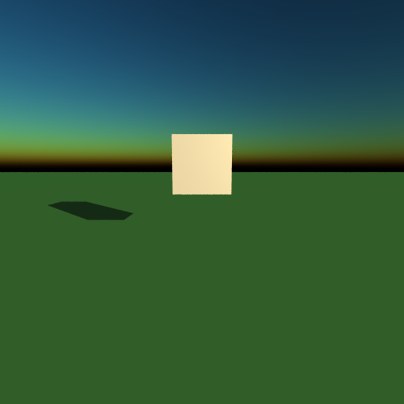
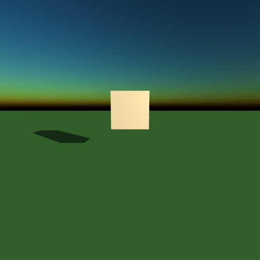
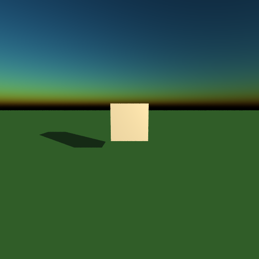


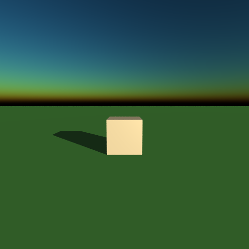
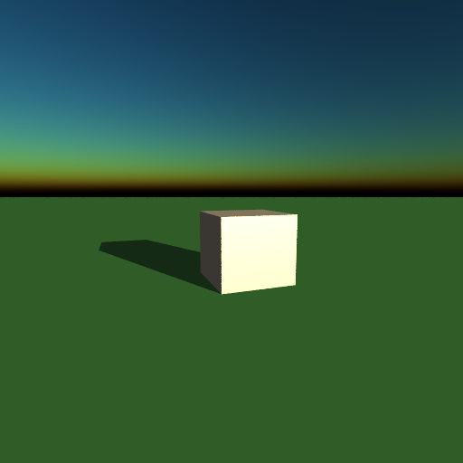
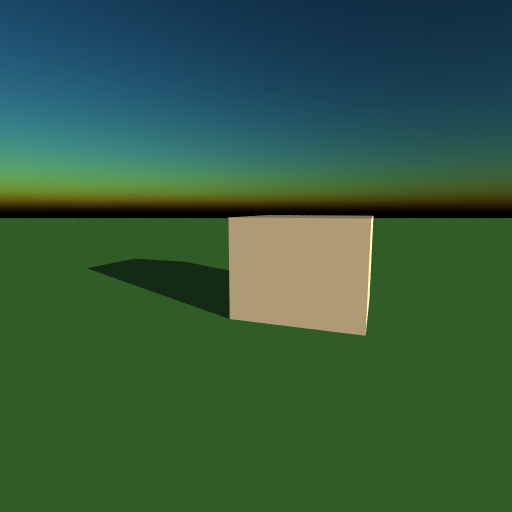
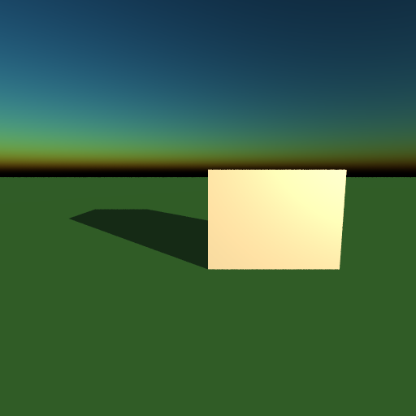

</div>

*10 frames (every even-numbered frame) taken from the 20 frames used to generate obj7.mp4. 2 keyframe nodes are used, to first translate the cube down with a quadratic ease-out, then translate right, rotate by 90 degrees, and scale up at the same time, with a quadratic in-out easing.*

For animated movement, a new **`KeyframeNode`** type was introduced, which has parameters for start time, end time, and an easing function. When traversing the scene hierarchy, the transform of a KeyframeNode at a given time $t$ (stored in the Ray struct) is the result of interpolating by $t$ between the identity transform at the start time and the node's transform as defined in the scene at the end time. In other words, an animation node represents two "keyframes", one at the start time with the identity transform, and one at the end time with the applied transform. Any scene nodes under an animation node will thus be animated, and multi-step animations can be achieved by composing a sequence of animation nodes (as children of each other). Animation nodes support a set of 4 standard easing functions: `linear`, `easeInQuad`, `easeOutQuad`, and `easeInOutQuad`.


### 8. Skydome-tinted fog

<div align="center">
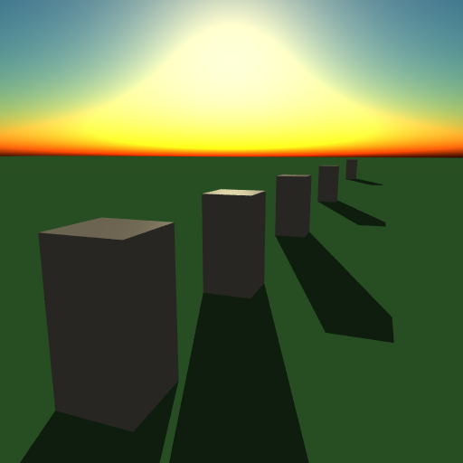


*The same scene rendered without (left) and with (right) the atmospheric fog effect. <br >(Note that all other scenes shown were rendered with this effect on by default.)*
</div>

We can actually make use of the same atmospheric scattering algorithm that we used for the skybox to provide a physically realistic atmospheric fog. To achieve this, the <code>Atmosphere::<strong>getAttenuation</strong></code> method takes an optional second parameter, `tMax`, which is used to provide the atmospheric fog effect. When a ray hits a scene object, we call the `getAttenuation` method with the same ray and `tMax=tHit`, which causes the view ray to be sampled between the origin and tMax rather than going all the way to its exit point with the atmosphere ($P_a$). This models a physically realistic fog, as Mie scattering is the same phenomenon responsible for low-lying fog.


### 9. Phong shading

<div align="center">
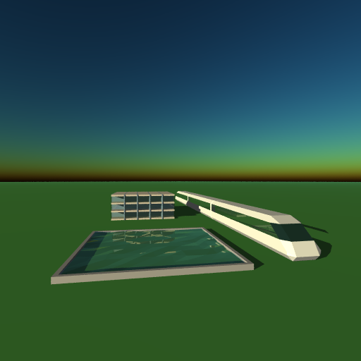
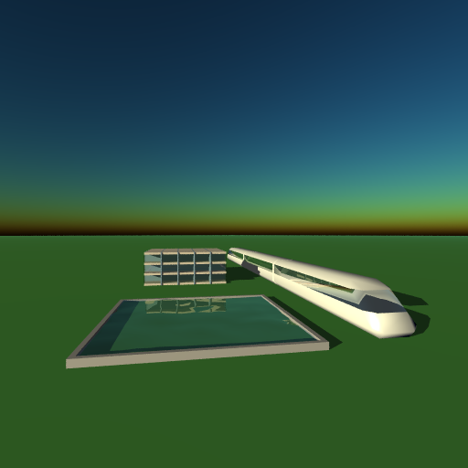

*The same scene rendered without (left) and with (right) anti-aliasing.<br />(Note that all other scenes shown were rendered with anti-aliasing on by default.)*
</div>


### 10. Final scene

<div align="center">
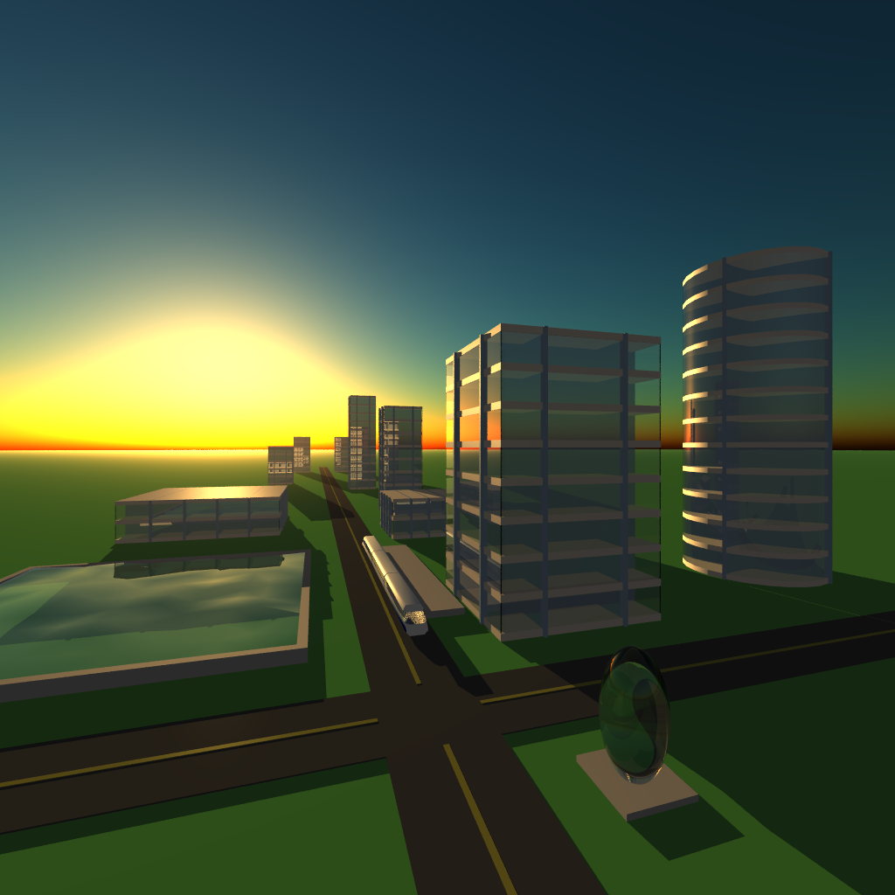

*One freeze frame from my final scene. See [final.mp4](Assets/final.mp4) for the full animation.*
</div>


## Bibliography

"Easing Functions." https://easings.net/. Accessed Jun. 2022. — for the easing functions for keyframe animation.

Nishita, Tomoyuki, et al. *Display of The Earth Taking into Account Atmospheric Scattering*. 1993. http://nishitalab.org/user/nis/cdrom/sig93_nis.pdf. — for the techniques to model a dynamic skydome.

"Simulating the Colors of the Sky." *Scratchapixel*, 8 Oct. 2015, https://scratchapixel.com/lessons/procedural-generation-virtual-worlds/simulating-sky/simulating-colors-of-the-sky.html. — for a synopsis and reference implementation of the Nishita 1993 paper.

Pharr, Matt, et al. "11. Volume Scattering." *Physically Based Rendering.* 2021, https://www.pbr-book.org/3ed-2018/Volume_Scattering. — for additional reading on volumetric rendering techniques.

Hable, John. "Filmic Tonemapping with Piecewise Power Curves." *Filmic Worlds*, 26 Mar. 2017, http://filmicworlds.com/blog/filmic-tonemapping-with-piecewise-power-curves/. —for Hable's filmic tonemapping method.

Dunn, Ian & Zoë Wood. "Chapter 33: Fresnel and Beer's Law." *Graphics Compendium*. https://graphicscompendium.com/raytracing/11-fresnel-beer. Accessed 25 Jul. 2022. — for a model of mixing direct, reflected and refracted (including Fresnel) illumination.

Shirley, Peter. *Raytracing in One Weekend*, 2018. https://www.realtimerendering.com/raytracing/Ray%20Tracing%20in%20a%20Weekend.pdf. — for a spherical perturbation method for Lambertian surfaces.


## Credits

- water volume mesh modeled by me, following instructions from https://blenderartists.org/t/how-to-make-low-poly-water/1149380/2

- train model originally from https://3dwarehouse.sketchup.com/model/ue54757cc-cb25-4e2d-bf21-38057e818a12/low-poly-train-form, modified by me
